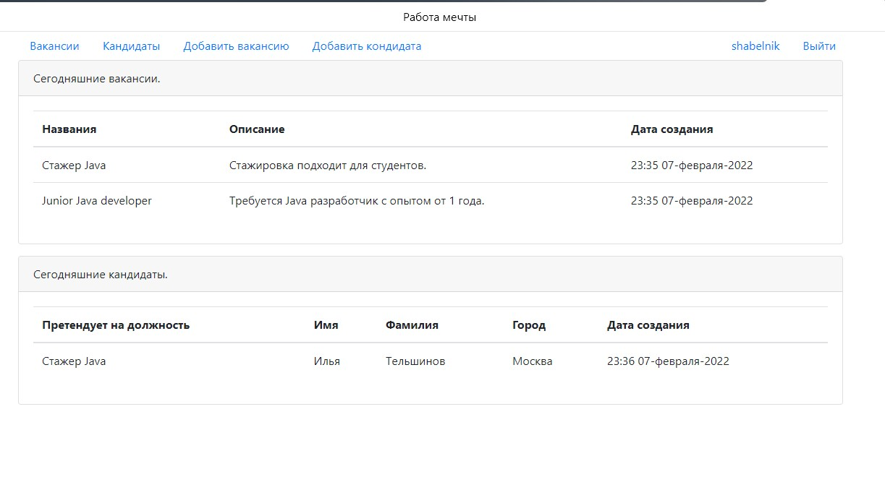
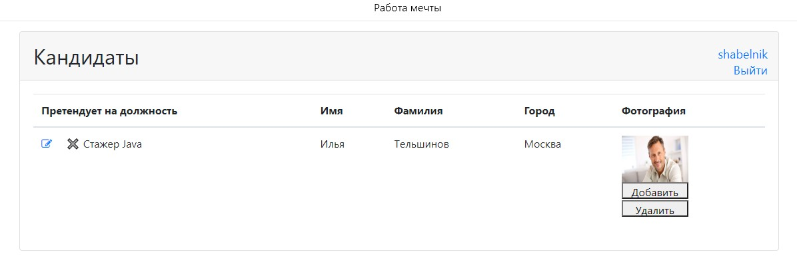
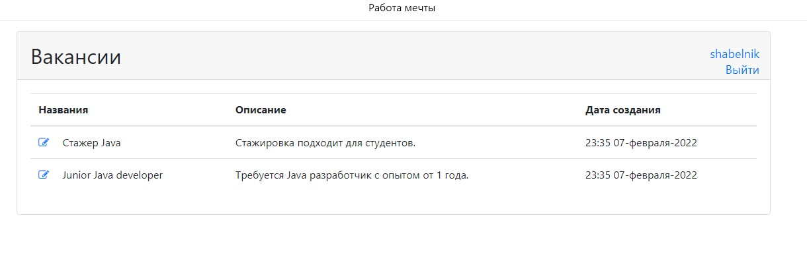
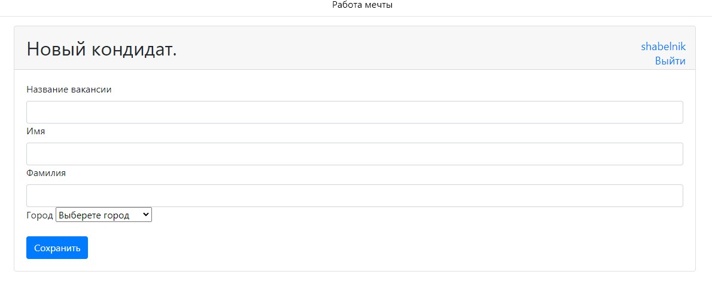
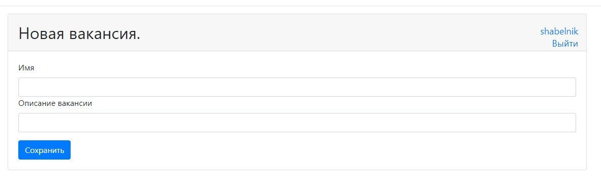

# job4j_dreamjob
Проект по разработке приложения "биржа работы". В системе будут два пользователя: 
кандидаты и кадровики. В рамках проекта изучены и использовались следующие технологии:
структура клиент-серверных
приложений, JSP, Ajax, Mockito, а также сопутствующие технологии.

Визуализация приожения:

